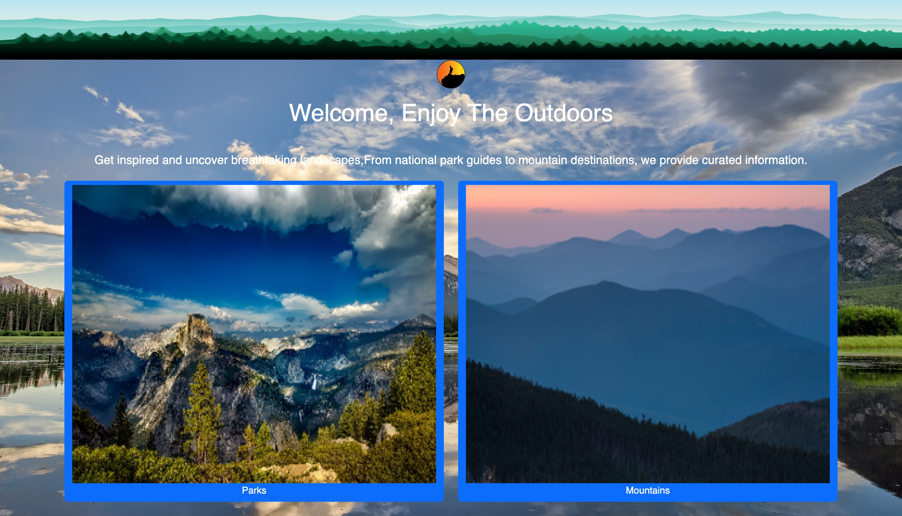
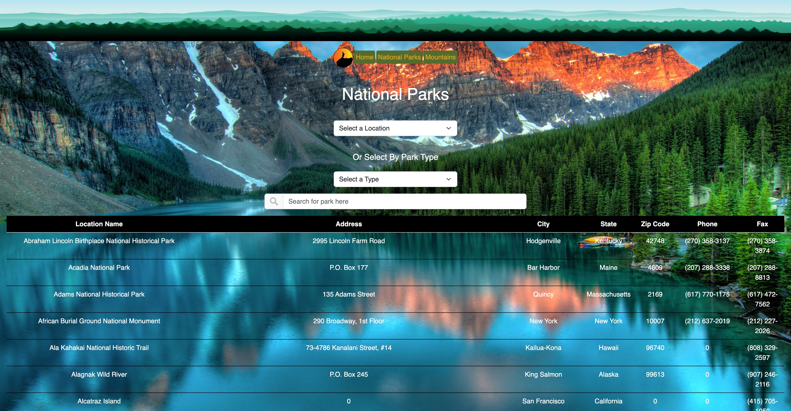
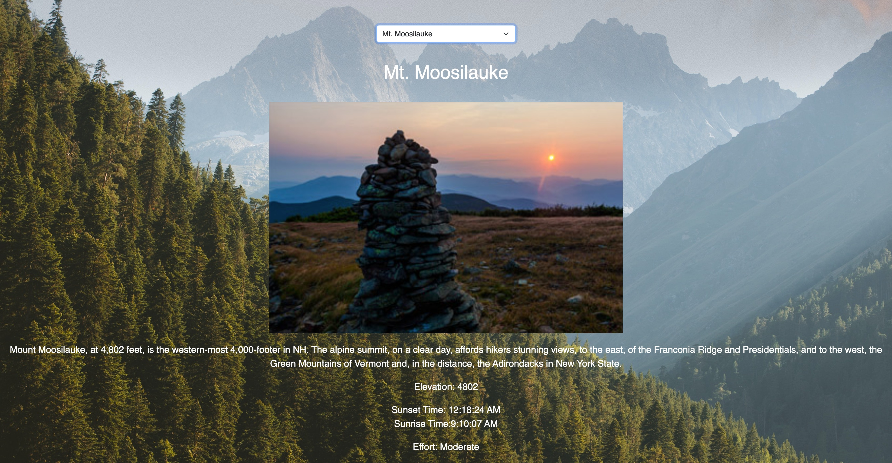

# National Park Explorer

**Welcome to the National Park Explorer! This website is designed to help you search and explore various natural landmarks and recreational areas across the United States. Whether you're looking for a serene hike, a historic battlefield, or a beautiful island to explore, This website has you covered.**

## Features

### Search

The National Park Explorer provides a powerful search feature that allows you to search for various types of landmarks, including:

<!-- ul -->

- National Parks
- National Monuments
- Recreational Areas
- scenic Trails
- Battlefields
- Historic Sites
- Memorials
- Preserves
- Islands
- Rivers
- Seashores
- Trails
- Parkways

simply enter your desired location or landmark type in the search bar or select by location or type from the option menus, and a table will display matching results.

## Mountains

In addition to the extensive list of national landmarks, the site also offers a dedicated page for finding mountains suitable for hiking. This feature allows outdoor enthusiasts to search through a list of mountains. It will present you with a description, mountain elevation, sunset and sunrise times and the difficulty level of the hike. Its a great resource for planning your next hiking adventure!

## User-Friendly Interface

The website is built using HTML, CSS, JavaScript, and Bootstrap, providing a modern user-friendly interface. The responsive design ensures that the website looks and works great on both desktop and mobile devices.

## Site Images

#### **homepage**

####

**National Parks Page**

####

**Mountains Page**

### Interesting piece of code

    const matches = nationalParksArray.filter((item) => {
      const locationMatch = item.State === locationValue || locationValue === "";
      const typeMatch =
        item.LocationName.toLowerCase().includes(typeValue.toLowerCase()) || typeValue === "";
      const searchMatch =
        item.LocationName.toLowerCase().includes(searchValue) ||
        item.State.toLowerCase().includes(searchValue);
      return locationMatch && typeMatch && searchMatch;
    });

    showCards(matches, results);

**This code helps implement the search bar its a neat feature because it searches the whole array for matches.**
